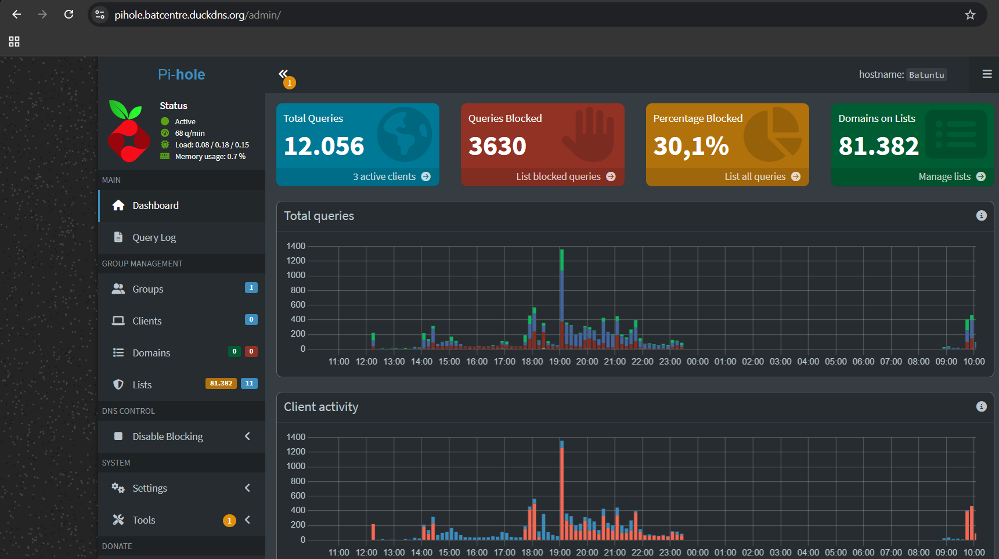

# 🛑 Tailscale Setup Notes
Tailscale is a zero-config, secure mesh VPN (Virtual Private Network) that makes it incredibly easy to connect your devices together, no matter where they are in the world.
---

## 🚀 How to Install tailscale

For this installation, I used a **Linux Container (LXC)** running **Linux Debian** inside Proxmox.

### 📋 Prerequisites
Before running the installer, make sure your system package list is up to date and that `curl` is installed. Run the following commands:
```bash
sudo apt update && sudo apt install curl -y
curl -fsSL https://tailscale.com/install.sh | sh
sudo tailscale up
```
## ⚙️ Post-Installation Configuration

Now that Tailscale is successfully installed via the CLI, you need to configure your devices to use it. 
###  Authenticate 
To connect your machine to your personal mesh network (your "tailnet"), initialize Tailscale by running:

1)The terminal will output a unique login URL.
2)Copy and paste the link into your web browser.
3)Log in using your favorite browser.
4)Once authenticated, your terminal will confirm the successful connection.


## 📊 Dashboard Overview
Below is the visual overview of my **Tailscale Dashboard**:



